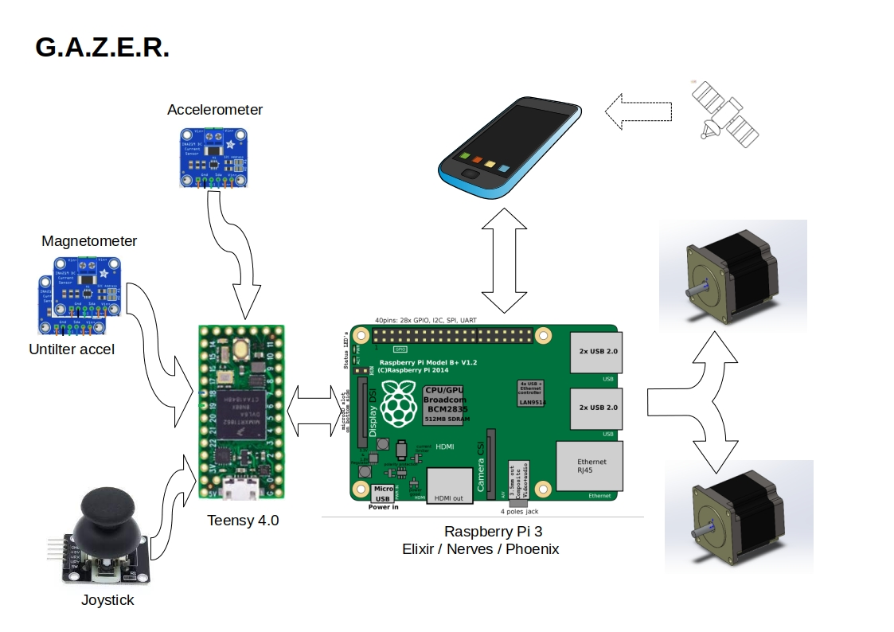

# GAZER

it's a no-hassles, sensors based, GOTO system to drive amateurial telescopes on altazimutal mounts.

No-hassles means that you setup the scope, launch the automatic calibration procedure, acquire the GPS position on your smartphone, and you are ready to aim at your desired sky objects. **No star alignement required**. **No internet connection is required**, thus it can be used in remote, clear sky location, where data services may be unavailbale.

The telescope aim is determined via magnetometer and accelerometer sensors, while corrections/precise centering are commanded manually via a Joystick.

Note that the precision of sensors, especially magnetometers, is limited to half a degree. While this is not sufficient for precision tracking, it is well enough to hit the targeted object in the field of view of a low power eyepiece.

Object Tracking is then based on precise calculations, not on the sensors readings.

The system is composed of the following components:
* Sensors for azimuth and altitude determination. These are rigidly fixed to the telscope tube or mount.
* Arduino microcontroller (Teensy 4.0 is required. ESP32 will also fit) which performs
	* Magnetometer calibration
	* Sensors readings
	* Calculation of Altitude and Azimuth
	* Joystick movement readouts
* a PCB to be populated with Teensy and Stepper Drivers and to plug-in sensors and joystick cables. The PCB is finally plugged in the RPi GPIO connector.
* Raspberry Pi 3 hosts the Nerves/Elixir code to
	*  control the stepper motors
	*  read the data acquired by the Teensy microcontroller
	*  execute the astronomical algorithms for aiming and tracking objects
	*  connect to the user's smartphone to acquire GPS position
	*  provides the access point to connect the smartphone to access the **Web Based GUI** for scope control.
	*  provides a full blown version of the NGC catalog and solar system object positions
* User's Smartphone
	* The user needs to install the "GPSd Forwarder" app -- opensource and available on Google Play Store -- therefore only Android phones are currently supported, however a flutter app is in the plans which will support both Android and IOS devices. No schedule available at the moment.
	* Any mobile web browser to display the GUI

More information on each component is provided in the respective folders.

## What's still to be completed - work in progress

- [ ] Unit tests
- [ ] Documentation
- [ ] Flutter application as alternative to browser based GUI

## How to build
1. download gerber files from the hardware sections and get the pcb etched by your favorite service
2. follow the instructions in hardware folder
3. flash the teensy with the sketch in arduino folder
4. plug the teensy on the PCB socket
5. plug the PCB onto the RPi3 GPIO
6. flash the RPi3 card with the nerves image provided in raspberry folder. Or, if preferred, compile the source code and use the elixir/nerves commands to flash the card
7. connect sensors and motors to the RPi box
8. boot the RPi3
9. Verify the smartphone connectivity. Select gazer access point and connect to 192.168.3.1
10. install "GPSd Forwarder" from Play Store and turn it on
11. Enjoy a star gazing night !

## License
the project is released under AGPLv3 License (the dependencies have their own licences)
