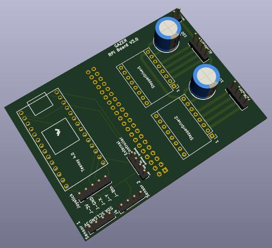
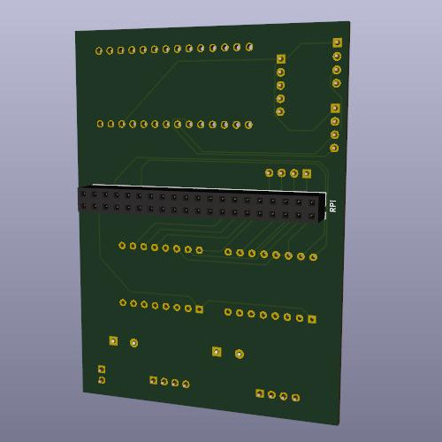

## Hardware description
The Hardware for GAZER system is composed of following items:
* 1 x Raspberry Pi 3
* 1 x Teensy 4.0
* 1 x PCB - Gerber files available in this repository
* 2 x Stepper motor controller. Tested with DRV8825. Any other model with same pinout should be ok
* 1 x Analogue Joystick, 2 axis 1 button, with 5 pins connector
* 2 x 4 pins cables and connectors for the sensors
* 1 x 5 pins cable and connectors for the joystick
* 1 x MEMS Magnetometer. Tested with LIS3MDL and FXOS_8700
* 1 x MEMS Accelerometer. Tested with FXOS_8700

**Note**
the FXOS_8700 chip combines magnetometer and accelerometer, however they need to be separate. Two boards would be required anyway.

### PCB Assembly

The PCB shows clear indications about what needs to be plugged where. Just solder the two 100uF capacitors, the sockets and pin connectors where they need to be and plug in the components.

**Note**
The 40 pin socket to the Raspberry PI needs to be positioned on the back of the PCB (solder on the front).

The two sensors sockets are 100% interchangeable.
